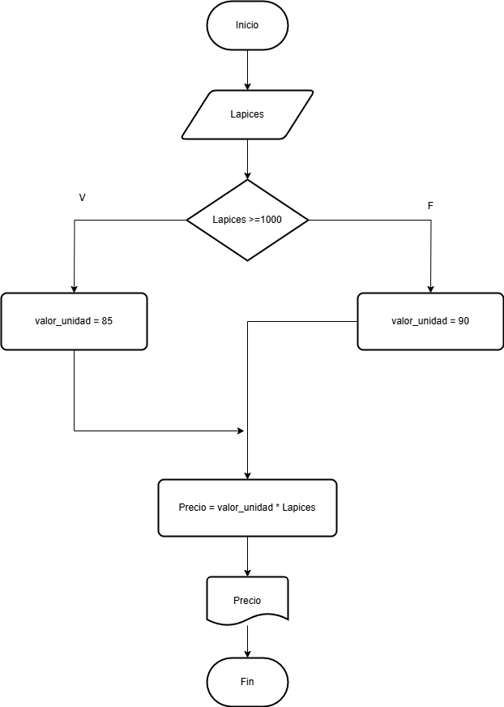

# Pseudocodigo

[Simbolos diagrama de flujo](https://www.smartdraw.com/flowchart/simbolos-de-diagramas-de-flujo.htm)


## Ejercicio 2
Construye un algoritmo que, al recibir como datos el ID del empleado y los seis primeros sueldos del año, calcule el ingreso total semestral y el promedio mensual, e imprima el ID del empleado, el ingreso total y el promedio mensual.

### Solución
```
Inicio
Leer ID. S1, S2, S3, S4, S5, S6
Total = S1 + S2 + S3 + S4 + S5 + S6
Promedio Total /6
Escribir ID, Total Promedio 
Fin
```


## Tarea 

El curso se evalua con 7 notas, se conocen 6 notas que equivalen al 70% 
Calcular cuanto debe sacar en la evaluacion final para aprobar con 3


### SOLUCION 

```
Inicio
Leer N1, N2, N3, N4, N5, N6.
Promedio= N1+N2+N3+N4+N5+N6 / 6
NotaFinalNecesaria = (3.0 - (Promedio * 0.7)) / 0.3
Escribir NotaFinalNecesaria
Fin
```


## Ejercicio 3 - Estructuras selectivas

Realice un algoritmo para determinar cuánto se debe pagar por equis cantidad de lápices considerando que si son 1000 o más el costo es de $85 cada uno; de lo contrario, el precio es de $90. Represéntelo con el pseudocódigo y el diagrama de flujo.

|Variables|Tipo|Comentario
|---------|----|-----------|
|Lapices|Entrada|Cantidad de lapices|
|Precio| Salida| Precio total de los lapices |
|valor_unidad| Intermedia | Valor unitario de cada lapiz|
|85, 90|Constantes| No cambian |
### Pseudocodigo
```
Inicio
Leer Lapices
Sí Lapices >= 1000:
    valor_unidad = 85
Sí no 
    valor_unidad = 90
Fin sí
Precio = Lapices * valor unidad
Escribir "El valor total es:", Precio
Fin
```
)

## Ejercicio 4

Un almacén de ropa tiene una promoción: por compras superiores a $250 000 se les aplicará un descuento de 15%, de caso contrario, sólo se aplicará un 8% de descuento. Realice un algoritmo para determinar el precio final que debe pagar una persona por comprar en dicho almacén y de cuánto es el descuento que obtendrá. Represéntelo mediante el pseudocódigo y el diagrama de flujo.

### Analisis
|Variables|Tipo|Comentario|
|---------|----|-----------|
|total_compra  | Entrada | Valor de la compra|
| descuento | Salida | Descuento segun el valor de la compra|
| precio_final | Salida | Valor a pagar con descuento|
| 15%, 8%, 250000| Constantes | Descuentos |

```
Inicio
Leer total_compra
Sí total_compra > 250000:
    descuento = total_compra * 0.15
Sí no 
    descuento = total_compra * 0.08
Fin Sí 
precio_final = total_compra - descuento
Escribir "Valor a pagar:", precio_final
Fin
```

## Ejercicio 5
El director de una escuela está organizando un viaje de estudios, y requiere determinar cuánto debe cobrar a cada alumno y cuánto debe pagar a la compañía de viajes por el servicio. La forma de cobrar es la siguiente: si son 100 alumnos o más, el costo por cada alumno es de $65.00; de 50 a 99 alumnos, el costo es de $70.00, de 30 a 49, de $95.00, y si son menos de 30, el costo de la renta del autobús es de $4000.00, sin importar el número de alumnos.

### Analisis
|Variables|Tipo|Comentario|
|---------|----|-----------|
|alumnos| Entrada| Cantidad de estudiantes|
|costo_alumno|Salida|Lo que le toca a cada uno|
|Costo_total|Salida| Lo que toca pagar a la compañia|
100, 50-99, 30-49|Constantes| Rango de numero de alumnos|

```
Inicio
Leer alumnos 
Sí alumnos >= 100
    costo_alumno = 65
Sí no
    Sí alumnos >=50
        costo_alumno = 70
    Sí no
        Sí alumnos >= 30
            costo_alumno =95
              
        Sí no 
            costo_total =4000
            costo_alumno = costo_tota/alumnos
        Fin Sí
    Fin Sí
Fin Sí
costo_total = costo_alumno * alumnos        
```

## Tarea 2 

Ingresar la fecha exacta de nacimiento y la fecha actual. calcular la edad 
### Analisis
|Variables|Tipo|Comentario|
|---------|----|----------|
|Dia-n|Entrada|Dia exacto de nacimiento|
|Mes-n|Entrada|Mes exacto de nacimiento|
|Año-n|Entrada|Año exacto de nacimiento|
|Dia-a|Entrada|Dia actual|
|Mes-a|Entrada|Mes actual|
|Año-a|Entrada|Año actual|

    Inicio
    
    Leer Dia-n
    Leer Mes-n
    Leer Año-n

    Leer Dia-a
    Leer Mes-a
    Leer Año-a

    Edad-actual = Año-a - Año-n

    Si Mes-n > Mes-a Entonces
        Edad-actual = Edad-actual - 1
    Sino
        Si Mes-n == Mes-a Entonces
            Si Dia-n > Dia-a Entonces
                Edad-actual = Edad-actual - 1
            FinSi
        FinSi
    FinSi

    Escribir "La edad actual es:", Edad-actual
    Fin


## Bucles o ciclos 

## Ejercicio 2 bucles 

Se requiere un algoritmo para determinar de n cantidades cuantas son cero. cuantas son menores a cero y cuantas son mayores a cero.
Realice el diagrama de flujo y el pseudocódigo representarlo, utilizando el ciclo apropropiado 

|Variables|Tipo|
|---------|----|
|N|input|
|ceros, mayores, menores| output (contador)|
|N| Variable de control|

```
Inicio 
Leer N
ceros = 0
mayores = 0
menores = 0
Mientras N > 0:
    Leer cant
    Si cant >0:
        mayores = mayores + 1
    Si no
        Si cant = 0:
            ceros = ceros + 1
        Si no 
            menores = menores +1 
        Fin si 
    Fin si 
    N = N - 1
Fin Mientras
Escribir ceros, mayores, menores
Fin
```
## Ejercicio 3
Calcular el factorial de un nuemero entero ingresado por el usuario.

```
Inicio
Leer N
Factorial = 1
Mientras N > 0:
    Si N = 0:
        Factorial= i
    Si no 
        Factorial = Factorial*N
        N = N - 1
Fin Mientras
Escribir "El factorial es:", factorial
Fin

## TAREA CICLOS
```
INICIO

    DEFINIR tasa_interes COMO 0.02

    MOSTRAR "Ingrese el valor de la compra:"
    LEER valor_compra

    MOSTRAR "Ingrese el número de cuotas:"
    LEER num_cuotas

    SI tasa_interes == 0 ENTONCES
        cuota = valor_compra / num_cuotas
    SINO
        cuota = valor_compra * [tasa_interes * (1 + tasa_interes)^num_cuotas] / [(1 + tasa_interes)^num_cuotas - 1]
    FIN SI

    MOSTRAR "El valor de cada cuota es: ", cuota

    PARA i DESDE 1 HASTA num_cuotas HACER
        MOSTRAR "Cuota ", i, ": ", cuota
    FIN PARA

FIN
```

```

```

