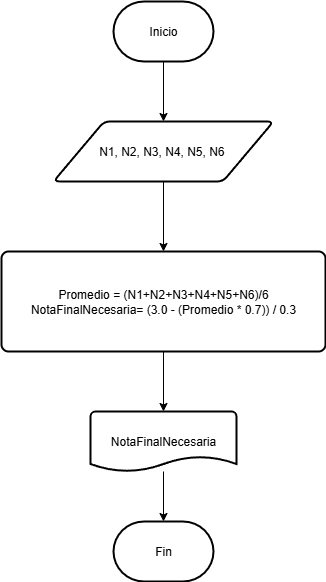

# Pseudocodigo

[Simbolos diagrama de flujo](https://www.smartdraw.com/flowchart/simbolos-de-diagramas-de-flujo.htm)


## Ejercicio 2
Construye un algoritmo que, al recibir como datos el ID del empleado y los seis primeros sueldos del año, calcule el ingreso total semestral y el promedio mensual, e imprima el ID del empleado, el ingreso total y el promedio mensual.

### Solución
```
Inicio
Leer ID. S1, S2, S3, S4, S5, S6
Total = S1 + S2 + S3 + S4 + S5 + S6
Promedio Total /6
Escribir ID, Total Promedio 
Fin
```


## Tarea 

El curso se evalua con 7 notas, se conocen 6 notas que equivalen al 70% 
Calcular cuanto debe sacar en la evaluacion final para aprobar con 3


### SOLUCION 

```
Inicio
Leer N1, N2, N3, N4, N5, N6.
Promedio= N1+N2+N3+N4+N5+N6 / 6
NotaFinalNecesaria = (3.0 - (Promedio * 0.7)) / 0.3
Escribir NotaFinalNecesaria
Fin
```

